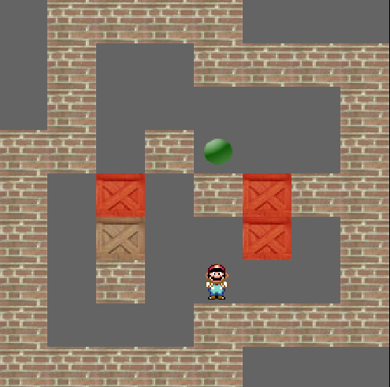

# mario sokoban

Mario sokoban project of [openclassrooms](https://openclassrooms.com/fr/courses/19980-apprenez-a-programmer-en-c/18709-tp-mario-sokoban)
(in C++ instead of C because I can't be bothered).



# Usage

```
make all
./mario_sokoban
./mario_sokoban [mapfile]
```

# Dependencies

- [SDL2](https://libsdl.org)
- [SDL_Image](https://www.libsdl.org/projects/SDL_image)
